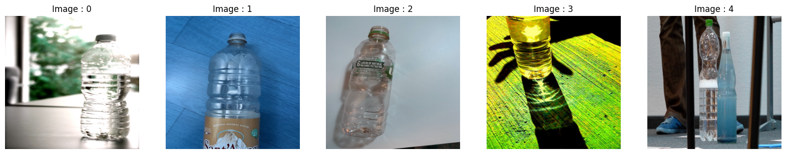

<H1 align="center", style="color:#ff0000">Greenox Internship Test</H1>

<H3 align="center">~M.SAKSHAM</H3>

<!-- TOC -->

# Data Extraction to G-Drive

* The ZIP File needs to be extracted in G-Drive to use it.

```Python
 # Mount Drive...

from google.colab import drive
drive.mount('/content/gdrive')
```

```Python
# import...

from zipfile import ZipFile

```

``` Python
# define the paths...

with ZipFile('/content/gdrive/MyDrive/Greenox/mainbottledataset.zip', 'r') as zipObj:  # path of folder or file...
    zipObj.extractall('/content/gdrive/MyDrive/Greenox/Bottle_Data/')  # path to save file or folder...

print('Done...')
```

# Download the Image / File Directly in Colab

* Any image or data needs to get directly into Colab

```Python
# paste the link/url...
 !wget https://www.apple.com/newsroom/images/live-action/wwdc-2023/standard/privacy/Apple-WWDC23-privacy-logo-230605_big.jpg.large_2x.jpg
```


# Task - 1  : Training a YOLOv5 model on a custom dataset on Google Colab

## Model Setup

```Python
!git clone https://github.com/ultralytics/yolov5  # clone...
%cd yolov5
%pip install -qr requirements.txt comet_ml  # install...

import torch
import utils

display = utils.notebook_init()  # checks...
```

### Dataset

``` markdown
 Bottle_Data 
 ├── train
     └── images ← 11,978 imgs
     └── labels ← 11,978 files
     └── labelfiles.txt
 └── valid
     └── images ← 3,721 imgs
     └── labels ← 3,721 files
```

### yaml file

* Custom `.yaml` file

```yaml
# YOLOv5 🚀 Model on Bottle_Data by M.SAKSHAM

# Paths
train: /content/gdrive/MyDrive/Greenox/Bottle_Data/train/images  # train images path to 11,978 images
val: /content/gdrive/MyDrive/Greenox/Bottle_Data/valid/images  # val images path to 3,721 images

# Classes
nc: 6  # number of classes
names:
  0: pet_bottle
  1: wine_bottle
  2: beer_bottle
  3: aluminium_can
  4: barcode
  5: tetrapack
```

### Train Model

```Python
# Train YOLOv5s on Bottle_Data for 10 epochs...
!python train.py --img 640 --batch 16 --epochs 10 --data /content/yolov5/data/bottle_data.yaml --weights yolov5s.pt --cache
```

## Results...

### Test : Image 1


### Result


---

# Task - 3 : Instance Retrieval using DINOv2

## Constants...

* Some common Constants, used multiple times.

```Python
ROOT_DIR = "/content/gdrive/MyDrive/Greenox/Bottle_Data/train/images/"
EMBEDDINGS_FILE = "all_embeddings.json"
INDEX_FILE = "data.bin"
IMG_SIZE = (416, 416)
```

### Filter the images...

* The images are filtered, if not `RGB` and not `.jpg` format.

```Python
def get_files_in_directory(directory, extension=".jpg"):
    files = [os.path.join(directory, f) for f in os.listdir(directory) if f.lower().endswith(extension)]
    return [f for f in files if Image.open(f).mode == 'RGB']
```

### Helper Functions...

* This function is used convert the normal image to Tensor form.

```Python
def load_image(img_path: str) -> torch.Tensor:
    transform_image = T.Compose([T.ToTensor(), T.Resize(244), T.CenterCrop(224), T.Normalize([0.5], [0.5])])
    img = Image.open(img_path)
    transformed_img = transform_image(img)[:3].unsqueeze(0)
    return transformed_img
```

### Main Function...

* This class includes the model loading feature extraction and defining the index for each loaded image so, that we can collect it later. 
* Each image is embedded and loaded.

```Python
class ImageFeatureExtractor:
    def __init__(self, model_name="facebookresearch/dinov2", model_variant="dinov2_vits14"):
        self.device = torch.device('cuda' if torch.cuda.is_available() else "cpu")
        self.model = torch.hub.load(model_name, model_variant).to(self.device)

    def extract_features(self, image_paths):
        index = faiss.IndexFlatL2(384)
        all_embeddings = {}

        with torch.no_grad():
            for file in tqdm(image_paths):
                embeddings = self.model(load_image(file).to(self.device))
                embedding = embeddings[0].cpu().numpy()
                all_embeddings[file] = embedding.reshape(1, -1).tolist()
                index.add(embedding.reshape(1, -1))

        with open(EMBEDDINGS_FILE, "w") as f:
            f.write(json.dumps(all_embeddings))

        faiss.write_index(index, INDEX_FILE)

        return index, all_embeddings

    def retrieve_instances(self, query_image_path, top_k):
        with open(EMBEDDINGS_FILE, "r") as f:
            all_embeddings = json.load(f)

        index = faiss.read_index(INDEX_FILE)

        with torch.no_grad():
            embedding = self.model(load_image(query_image_path).to(self.device))
            D, I = index.search(embedding[0].cpu().numpy().reshape(1, -1), top_k)

        return I[0]

```

### Usage...

```Python
image_paths = get_files_in_directory(ROOT_DIR)
print("Total Images : {}\n".format(len(image_paths)))

feature_extractor = ImageFeatureExtractor()
feature_extractor.extract_features(image_paths)
top_k = 50  # Define the similar images needed...

query_image_path = "/content/gdrive/MyDrive/Greenox/Bottle_Data/Test/bottle_1.jpg"
top_results = feature_extractor.retrieve_instances(query_image_path, top_k = top_k)
```

## Results...

### Test : Image 1


### Result


.png)
.png)
.png)
.png)
.png)
.png)
.png)
.png)
.png)

---

### Resources

* ChatGPT
* Google
* Blogs
