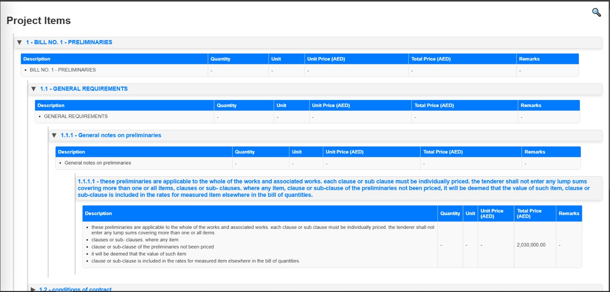
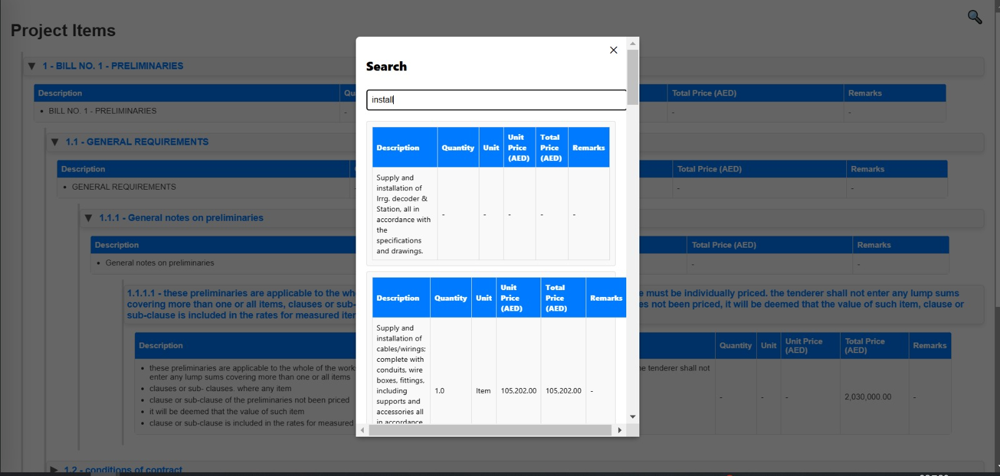
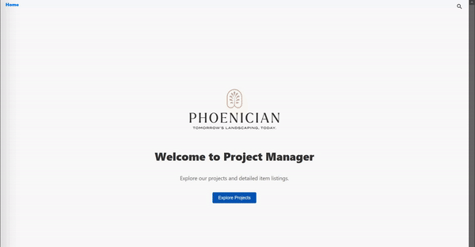

# Phoenician - Assignment
> M SAKSHAM

A React & Django based project management application that allows users to view projects and related details, including navigation and quick search, integration for a responsive and interactive interface.

## Table of Contents

- [Phoenician - Assignment](#phoenician---assignment)
  - [Table of Contents](#table-of-contents)
  - [About the Project](#about-the-project)
  - [Getting Started](#getting-started)
    - [Prerequisites](#prerequisites)
    - [Installation](#installation)
    - [Running the Backend and Frontend Together](#running-the-backend-and-frontend-together)
  - [File Structure](#file-structure)
  - [Demo Images](#demo-images)
  - [Contributing](#contributing)

## About the Project

This project provides a simple project management application where users can view project details, navigate between projects, and view items associated with each project. It includes features like navigation and quick search and tree interface.

## Getting Started

Follow these instructions to get a local copy of the project up and running.

### Prerequisites

- Python 3.6 or above
- pip (Python package manager)
- Django (version 3.2 or above)
- Node.js (version 14 or above)
- npm (version 6 or above)

### Installation

1. Clone the repository:

   ```bash
   git clone -n --depth=1 --filter=tree:0 https://github.com/Saksham093/Data-Science/tree/main/Internship%20Work/Phoenician%20-%20Assignment
   ```

### Running the Backend and Frontend Together

1. **Start the Django Backend Server**:
   ```bash
   cd backend
   python manage.py runserver
   ```

2. **Start the React Frontend Server**:
   Open a new terminal window or tab, navigate to the frontend directory, and run:

   ```bash
   cd frontend
   npm start
   ```

The frontend will typically be served on `http://localhost:3001`, and the backend on `http://127.0.0.1:8000`. You may configure the frontend to interact with the backend by setting up environment variables or configuring API request URLs directly in the React app.

---

## File Structure

```
project/
├── backend/
├── frontend/
└── data
```

## Demo Images







## Contributing

Contributions are welcome! Please fork the repository and create a pull request with your changes. Ensure your code follows the project structure and includes comments for readability.

---
