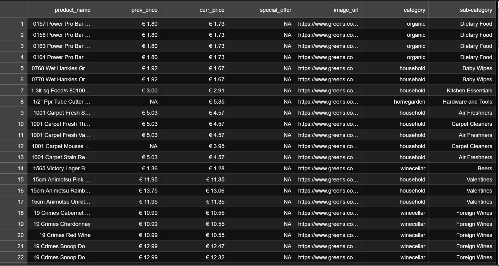

<h1 align="center"><b>Python Project Web Scraping</b></h1>



This project is developed to Scrap the website `Greens.com` using `BeautifulSoup` and `Python`.

## **Usage**

Install the Python Modules:

```Python
pip install beautifulsoup4

# and

pip install selenium

# and

pip install webdriver-manager
```

Then run the code file

```cli
python green_code.py
```

## **Contributing**

Contributions are welcome! If you find any issues with the script or have suggestions for improvements, please open an issue or submit a pull request.
